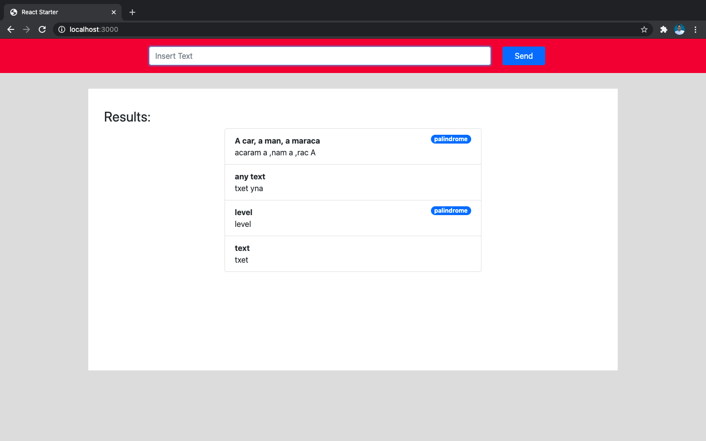

### TOOLBOX

# Full Stack JS - Code Challenge

## Antonio Herrera

Este repositorio está dividido en dos partes:

- **api/** API usando Node + Express
- **front/** Front usando React + Redux + Bootstrap

Las instrucciones para ejecutar las pruebas y levantar los servicios son las siguientes:

## API

1. Instalar depedencias

```bash
$ cd api
$ npm install
```

2. Ejecutar test

```bash
$ npm test
```

Los test se ejecutan con Mocha, Chai y SuperTest. Al inicio se ejecuta StandardJS para validar el estilo y formato del código.

3. Iniciar servicio

```bash
$ npm start
```

El servidor de Node se iniciará en el puerto 9001

## Front

Abrir una nueva ventana de terminal (o cmd en Windows)

1. Instalar depedencias

```bash
$ cd front
$ npm install
```

2. Ejecutar test

```bash
$ npm test
```

Los test se ejecutan con Jest.

3. Iniciar servicio

```bash
$ npm start
```

La aplicación corre en http://localhost:3000/ y muestra las respuestas desde la última hasta la primera.

Los resultados incluyen el texto original, el texto reversado y un flag que identifica si la cadena es un palindromo.


